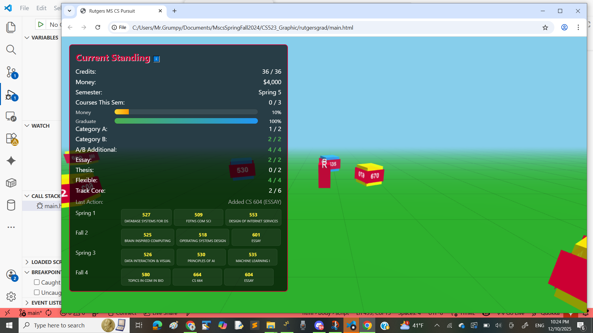
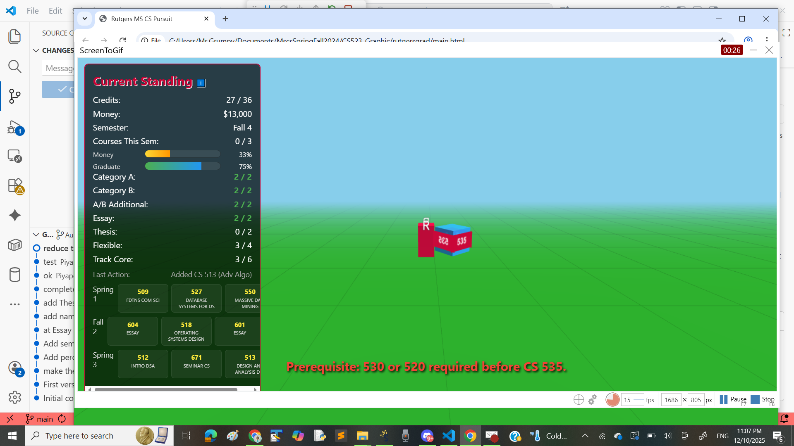
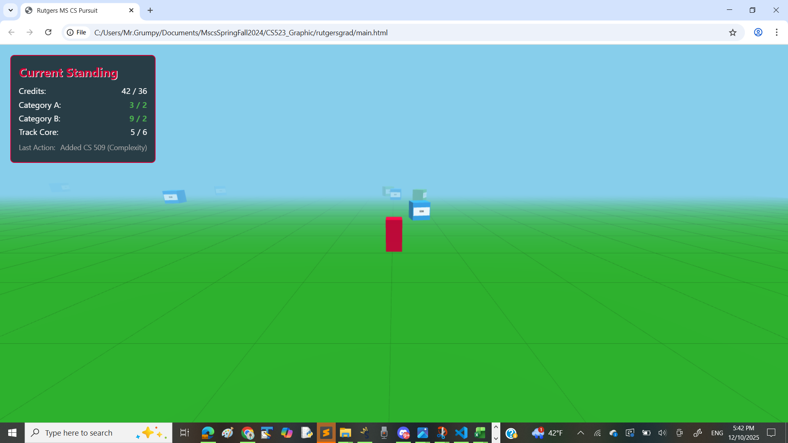
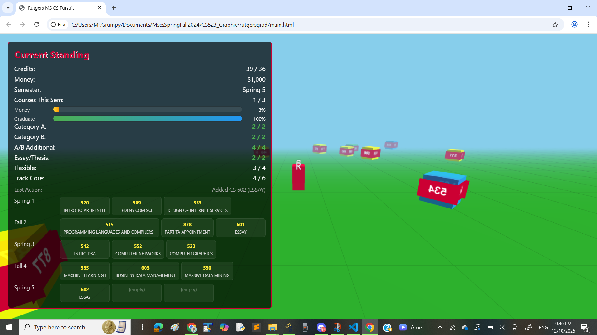
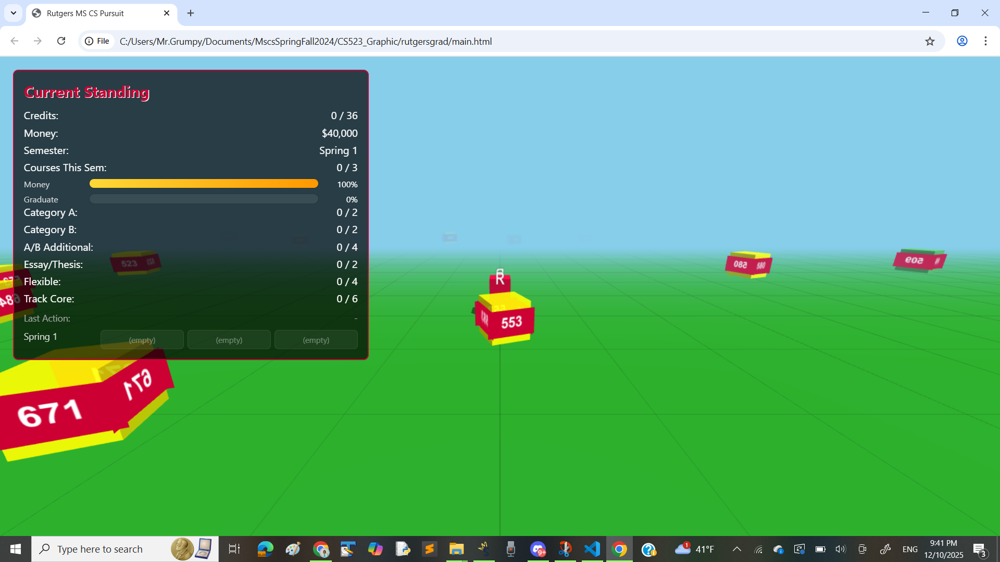
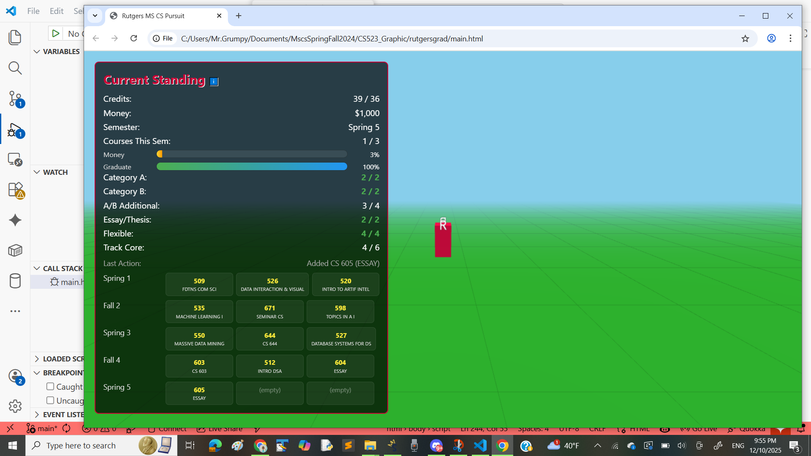
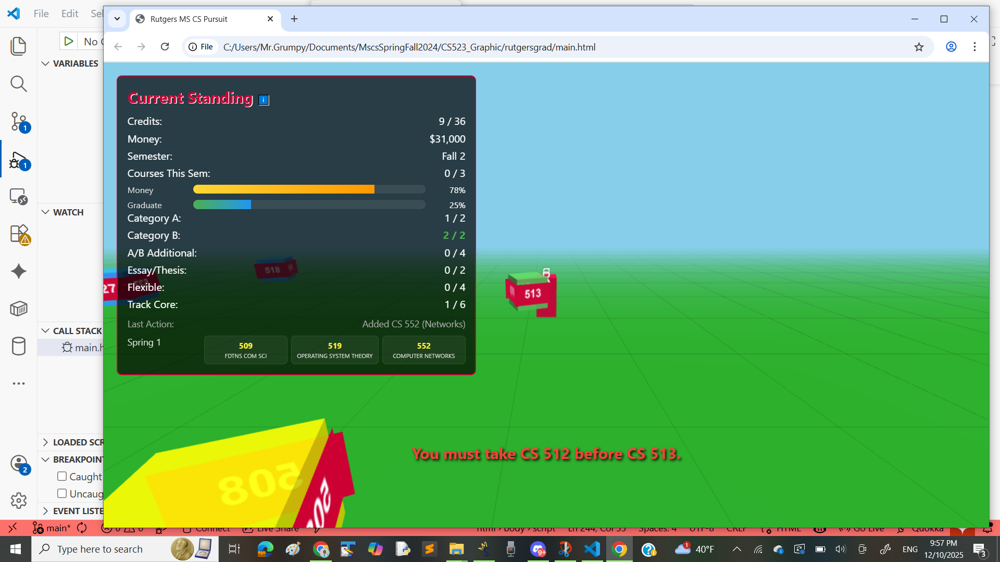

# Rutgers MS Computer Science Pursuit

**A 3D interactive game to help graduate students plan their MS in Computer Science degree path.**

## Overview

This project is an educational gamification tool designed to help incoming Rutgers MS Computer Science students understand degree requirements, course prerequisites, and semester planning. Students navigate a 3D virtual campus, collect courses, manage budgets, and satisfy all graduation requirements to "win" the game.

## Game Features

- **36 Credits Required (12 Courses)** to graduate
- **Degree Requirements:**
  - 2 courses from Category A (Math/Algorithms)
  - 2 courses from Category B (Systems/Applications)
  - 2 additional courses from Category A or B
  - Either 2 Essay Option courses OR 2 Thesis Option courses
  - Flexible MSCS-acceptable courses (seminars, independent study, approved other department courses)

- **Semester System:** Spring/Fall alternation with 3-course picks per semester (max 10 semesters)
- **Money System:** $40,000 starting budget; $3,000 per course; Game Over if funds depleted
- **Prerequisites Enforced:** Locked course chains (e.g., CS 512→513→514, CS 519→545, etc.)
- **Track Selection:** 6 specialization tracks (General CS, AI/Machine Learning, Massive Data Analytics, Robotics, Systems & Security, Vision & Graphics)
- **3D Campus Navigation:** Collect courses represented as colorful boxes scattered across a virtual campus

## Media

### Game Walkthrough (GIF)

### System Architecture & Linked Graph (GIF)

### Screenshots

## How to Play

1. **Open** `main.html` in a web browser
2. **Select a Semester:** Choose between Spring or Fall to start
3. **Select Degree Option:** Pick Essay Option or Thesis Option
4. **Choose Your Track:** Select from 6 specialization tracks
5. **Begin:** Click "Begin Semester" to enter the 3D game
6. **Collect Courses:** Use WASD or Arrow keys to move the red player cube
7. **Pick Up Courses:** Walk into colorful course boxes to collect them
   - **Green boxes:** Category A (Math/Algorithms)
   - **Blue boxes:** Category B (Systems/Applications)
   - **Yellow boxes:** Electives/Other courses
   - **Purple boxes:** Approved Other Department courses
8. **Manage Budget:** Each course costs $3,000 from your $40,000 budget
9. **Progress:** Monitor your degree requirements on the HUD (left panel)
10. **Win:** Satisfy all requirements and reach 36 credits (12 courses) to graduate!

## Technical Stack

- **3D Rendering:** Three.js (r128)
- **Language:** HTML5, CSS3, JavaScript (vanilla)
- **No Build Step:** Just open `main.html` in any modern browser

## Course Categories

### Category A (Math & Algorithms)
501, 509, 512, 513, 514, 581

### Category B (Systems & Applications)
507, 515, 518, 519, 520, 523, 525, 526, 527, 529, 530, 534, 535, 536, 538, 545, 550, 552, 553, 558, 560, 562

### Essay Option Courses
601, 602, 604, 605

### Thesis Option Courses
701, 702, 704, 705

### Flexible MSCS-Acceptable Courses
Seminars (671, 672), Independent Study (699), Approved Other Department courses (XXX)

## Files

- `main.html` – Main game file (HTML + CSS + Three.js)
- `README.md` – This file
- `img/` – Screenshots and GIFs
- `CS523_Piyaporn_pp227_FinalRUGame.pdf` – Final project documentation

**[Play the Game Online](https://nanpiyaporn.github.io/rutgersgrad/)**

## Author

Piyaporn (pp227)
MS Computer Science, Rutgers University, Fall 2024 / Spring 2025

## License

Educational use for Rutgers University CS523 Graphics course project.
